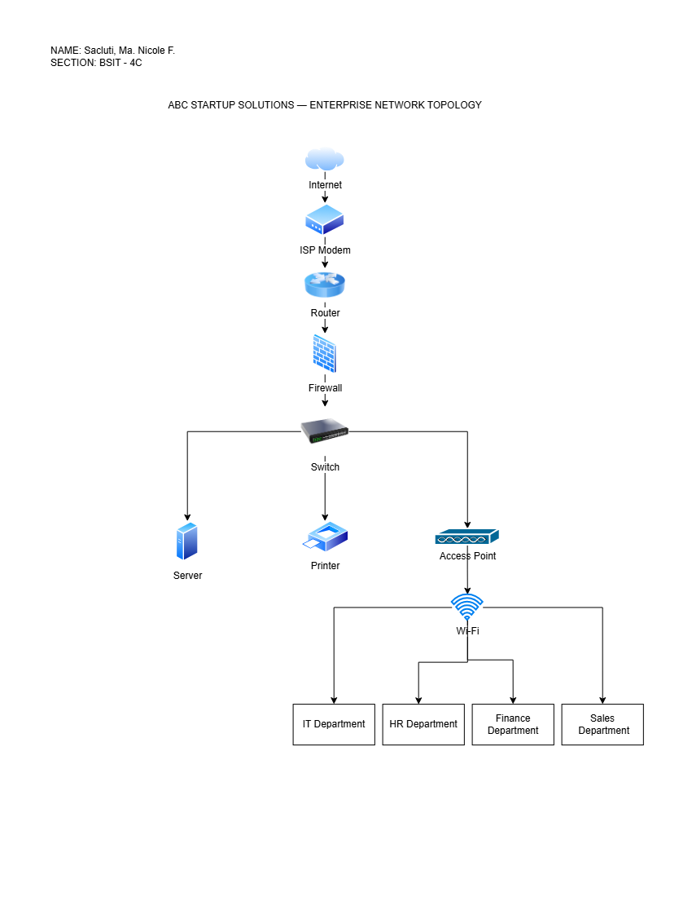

# ABC Startup Solutions

---

## Project Overview

Every successful IT infrastructure begins with proper planning.
Before purchasing computers, installing servers, configuring networks, or deploying
cloud services, a System Administrator must first understand the organization's
business requirements and design an infrastructure that supports business
operations.

In this project, you will assume the role of a **Junior System Administrator**
assigned to prepare the initial IT Infrastructure Plan of a newly established startup
company.

Your final output should resemble a professional document that could be
submitted to an IT Manager or Company Executive.

---

## Learning Objectives

At the end of this project, students should be able to:
### Knowledge
- Explain the roles and responsibilities of a System Administrator.
- Identify the hardware, software, and networking requirements of a small
business.
- Describe the purpose of IT documentation and infrastructure planning.

### Skills
Students will be able to:
- Analyze organizational IT requirements.
- Prepare professional IT inventories.
- Design an enterprise network topology.
- Create technical documentation using Markdown.
- Present infrastructure planning professionally.

### Attitude
Students are expected to demonstrate:
- Professionalism
- Organization
- Technical communication
- Attention to detail
- Critical thinking

---

## Project Scenario

You have recently been hired as the **Junior System Administrator** of **ABC Startup Solutions,** 
a newly established software development company.

The company currently has **20 employees** and occupies a single office floor.
Management has requested that you prepare the complete IT Infrastructure Plan
before purchasing equipment.

### Department Distribution

| Department             | Employees |
| ---------------------- | --------: |
| Information Technology |         5 |
| Human Resources        |         4 |
| Finance                |         5 |
| Sales                  |         6 |
| **Total**              |    **20** |

### Current IT Situation

The company currently has:

- No computers
- No server
- No network
- No internet infrastructure
- No security policies

The task is to design the company's IT infrastructure from scratch.

---

## Hardware Inventory Summary

ABC Startup Solutions will need different types of hardware to support its 20 employees and daily operations. The inventory includes 15 desktop computers, 5 laptops, 1 server, 2 network switches, 1 router, 2 printers, 4 UPS units, 3 wireless access points, 1 NAS storage, 2 external backup drives, and 20 monitors. These devices will provide employees with the equipment they need for their work while also supporting the company's network, file storage, printing, and backup needs. The hardware setup is also planned with extra capacity so the company can add more devices in the future.

---

## Software Inventory Summary

The company will use different software for daily office work, software development, system administration, security, and technical support. The main software includes Windows 11 Pro, Ubuntu Server, Microsoft 365, Visual Studio Code, Git, GitHub Desktop, VirtualBox, Google Chrome, Microsoft Defender, AnyDesk, and 7-Zip. These programs will help employees perform their daily tasks while giving the IT department the tools needed to develop software, manage servers, provide technical support, and maintain system security.

---

## Network Diagram

---

## Technologies Used

The project used different technologies and tools for planning the IT infrastructure of ABC Startup Solutions. These included Windows 11 Pro, Ubuntu Server, Microsoft 365, Visual Studio Code, Git, GitHub Desktop, VirtualBox, Google Chrome, Microsoft Defender, AnyDesk, and 7-Zip. For the network setup, technologies such as routers, switches, firewalls, wireless access points, CAT6 cables, and network servers were considered. Draw.io was also used to create the enterprise network diagram and show how the different devices and departments are connected.

---

## Challenges Encountered

One of the challenges encountered was deciding how much hardware and software the company actually needed for its 20 employees. It was important to choose enough equipment without adding unnecessary costs. Creating the network diagram was also challenging because I had to understand how the modem, router, firewall, switch, server, access points, and departments should be connected. Another challenge was deciding on the proper security, backup, and expansion plans. These challenges helped me understand that planning an IT infrastructure requires careful thinking and consideration of the company's actual needs.

---

## Reflection
Doing this project gave me a better understanding of what a System Administrator actually does in a company. Before starting the project, I thought that system administration was mostly about fixing computers, setting up networks, and solving technical problems. As I worked on each part, I realized that there is a lot of planning involved before any equipment or software is installed. I learned how to identify the hardware and software a company needs, plan a network, understand different IT roles, and consider security and backup solutions. I also learned that every decision should be based on the size and needs of the company.

The most challenging part for me was creating the enterprise network diagram. I had to figure out how the internet, modem, router, firewall, switch, server, printer, access points, and departments should be connected. It was also important to make the diagram organized and easy to understand. At first, I was not completely sure where some of the devices should be placed, but working through the network setup helped me understand how the different devices communicate with each other.

I also learned why planning is important before deploying an IT infrastructure. Without proper planning, a company could spend money on equipment that it does not need or forget something important. Planning also helps prevent problems with network connections, security, storage, and backups. It gives the company a clear idea of what equipment and resources are needed before the actual setup begins. It also makes it easier to prepare for future growth.

This project can help me become a better System Administrator because it allowed me to practice planning an IT infrastructure instead of only focusing on individual computers or devices. It taught me to look at the bigger picture and think about how everything works together. I also learned that a good System Administrator needs to be organized, patient, and willing to troubleshoot problems. Overall, this project helped me understand the responsibilities of the job better and gave me useful knowledge that I can apply to future projects and actual IT work.

---

## References

1. [U.S. Bureau of Labor Statistics — Computer Support Specialists][1]
2. [U.S. Bureau of Labor Statistics — Network and Computer Systems Administrators][2]
3. [Cisco — CCNA Certification][3]
4. [Cisco — Implementing and Administering Cisco Solutions][4]
5. [Red Hat — Red Hat Certified System Administrator (RHCSA)][5]
6. [Red Hat — RHCSA Exam Objectives][6]
7. [Microsoft Learn — Azure Administrator Associate][7]
8. [Microsoft Learn — AZ-104 Study Guide][8]

[1]: https://www.bls.gov/ooh/computer-and-information-technology/computer-support-specialists.htm
[2]: https://www.bls.gov/ooh/computer-and-information-technology/network-and-computer-systems-administrators.htm
[3]: https://www.cisco.com/site/us/en/learn/training-certifications/exams/ccna.html
[4]: https://www.cisco.com/site/us/en/learn/training-certifications/training/courses/ccna.html
[5]: https://www.redhat.com/en/services/certification/rhcsa
[6]: https://www.redhat.com/en/services/training/ex200-red-hat-certified-system-administrator-rhcsa-exam
[7]: https://learn.microsoft.com/en-us/credentials/certifications/azure-administrator/?practice-assessment-type=certification
[8]: https://learn.microsoft.com/en-us/credentials/certifications/resources/study-guides/az-104

---
