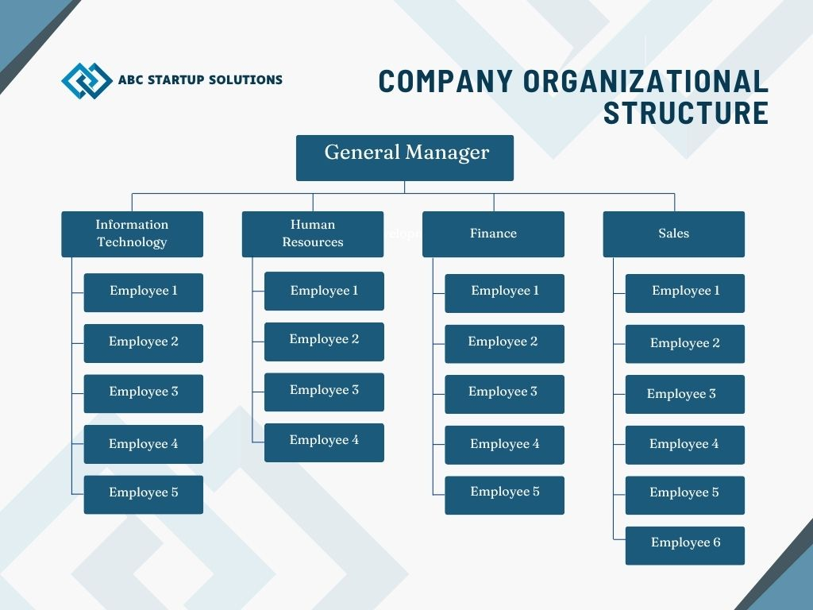

# ABC Startup Solutions

---

## Project Overview

Every successful IT infrastructure begins with proper planning.
Before purchasing computers, installing servers, configuring networks, or deploying
cloud services, a System Administrator must first understand the organization's
business requirements and design an infrastructure that supports business
operations.

In this project, you will assume the role of a **Junior System Administrator**
assigned to prepare the initial IT Infrastructure Plan of a newly established startup
company.

Your final output should resemble a professional document that could be
submitted to an IT Manager or Company Executive.

---

## Learning Objectives

At the end of this project, students should be able to:
### Knowledge
- Explain the roles and responsibilities of a System Administrator.
- Identify the hardware, software, and networking requirements of a small
business.
- Describe the purpose of IT documentation and infrastructure planning.

### Skills
Students will be able to:
- Analyze organizational IT requirements.
- Prepare professional IT inventories.
- Design an enterprise network topology.
- Create technical documentation using Markdown.
- Present infrastructure planning professionally.

### Attitude
Students are expected to demonstrate:
- Professionalism
- Organization
- Technical communication
- Attention to detail
- Critical thinking

---

## Project Scenario

You have recently been hired as the **Junior System Administrator** of **ABC Startup Solutions,** 
a newly established software development company.

The company currently has **20 employees** and occupies a single office floor.
Management has requested that you prepare the complete IT Infrastructure Plan
before purchasing equipment.

### Department Distribution

| Department             | Employees |
| ---------------------- | --------: |
| Information Technology |         5 |
| Human Resources        |         4 |
| Finance                |         5 |
| Sales                  |         6 |
| **Total**              |    **20** |

### Current IT Situation

The company currently has:

- No computers
- No server
- No network
- No internet infrastructure
- No security policies

The task is to design the company's IT infrastructure from scratch.

---

# PART 1 — Company Profile

## 1. Company Name

ABC Startup Solutions

## 2. Nature of Business

ABC Startup Solutions is a small software development company that creates **websites, software applications, and other IT solutions** for businesses. The company also provides **technical support and basic IT services** to its clients.

## 3. Company Vision

To become a trusted software company that provides useful and reliable technology solutions.

## 4. Company Mission

To provide quality and affordable software solutions while giving good service to our clients and creating a good working environment for our employees.

## 5. Office Location

Unit 613, ABC Business Center, National Highway, Santa Rosa, Laguna, Philippines

## 6. Organizational Structure

## 7. Employee Distribution

| Department             | Number of Employees |
| ---------------------- | ------------------: |
| Information Technology |                   5 |
| Human Resources        |                   4 |
| Finance                |                   5 |
| Sales                  |                   6 |
| **TOTAL**              |              **20** |

---

