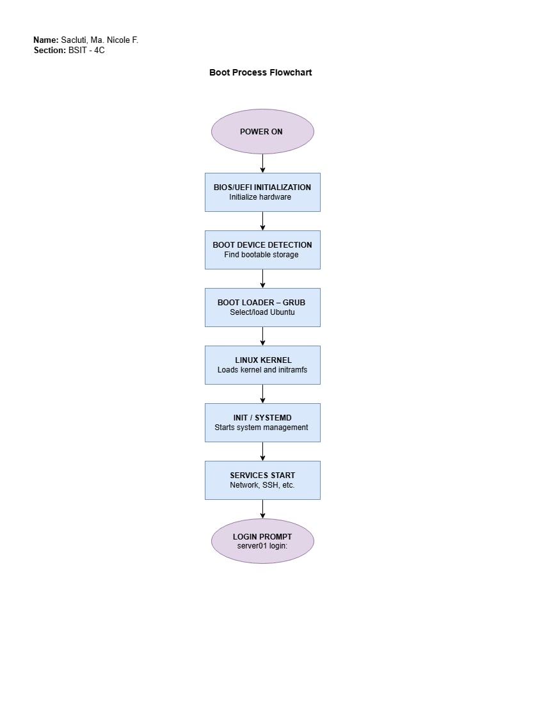

# Week 03 — Ubuntu Server Deployment and System Administration

## Project Overview

This Week 03 project focused on the installation, configuration, and verification of an Ubuntu Server virtual machine using Oracle VirtualBox. The activity simulated the responsibilities of a Junior System Administrator by requiring the deployment of a server operating system, configuration of essential system settings, verification of server functionality, and documentation of the installation process.

The project also included a comparison of BIOS and UEFI firmware technologies and the creation of a boot process flowchart to demonstrate how a computer starts and loads the operating system.

## Learning Objectives

By completing this project, I was able to:

* Install Ubuntu Server in a virtual machine using Oracle VirtualBox.
* Configure basic server settings such as hostname, user account, network, and system updates.
* Understand the basic administration of a Linux-based server.
* Use Linux commands to verify system information and server functionality.
* Understand the differences between BIOS and UEFI firmware.
* Identify the major stages of the computer boot process.
* Troubleshoot common installation and configuration problems.
* Apply basic system administration and security best practices.

## Virtual Machine Specifications

| Specification           | Details                 |
| ----------------------- | ----------------------- |
| Virtualization Software | Oracle VirtualBox       |
| Operating System        | Ubuntu Server           |
| OS Version              | Ubuntu Server 24.04 LTS |
| System Type             | 64-bit                  |
| CPU                     | 2 Virtual CPUs          |
| RAM                     | 4 GB                    |
| Storage                 | 25 GB Virtual Disk      |
| Network Adapter         | NAT                     |
| Firmware                | UEFI                    |
| Installation Type       | Virtual Machine         |
| Host Operating System   | Windows                 |

## Installation Summary

The Ubuntu Server virtual machine was created using Oracle VirtualBox. The required virtual hardware resources were assigned, including CPU, memory, virtual storage, and network connectivity. The Ubuntu Server ISO image was mounted as the virtual optical disk and used to start the installation.

During the installation process, the language, keyboard layout, network settings, storage configuration, user account, hostname, and server packages were configured. OpenSSH Server was also selected to allow remote administration of the server when needed.

After the installation was completed, the virtual machine was restarted and the Ubuntu Server system successfully booted from the virtual disk.

## Configuration Summary

After installation, the server was configured and prepared for basic system administration tasks. The system hostname and user account were verified, and the server was connected to the network using the configured network adapter.

System packages were updated using the Ubuntu package manager. Basic commands were also performed to check system information, disk usage, memory utilization, IP addressing, and network connectivity.

The following commands were used during configuration and verification:

```bash
sudo apt update
sudo apt upgrade -y
hostnamectl
ip addr
df -h
free -h
lsblk
ping -c 4 google.com
systemctl status ssh
```

These commands helped confirm that the operating system was properly installed, updated, and functioning correctly.

## Verification Results

The Ubuntu Server installation was successfully verified after completing the configuration process.

The `hostnamectl` command was used to confirm the system hostname and operating system information. The `ip addr` command was used to verify that the server had a valid network interface and IP address. The `df -h` command confirmed that the virtual storage was detected and available.

The `free -h` command was used to verify the available system memory, while `lsblk` confirmed that the virtual disk was properly recognized. Network connectivity was tested using the `ping` command, which successfully returned responses.

The SSH service was also checked using `systemctl status ssh` to confirm whether the OpenSSH service was running correctly.

Overall, the verification results showed that the Ubuntu Server virtual machine was successfully installed, configured, connected to the network, and ready for basic server administration tasks.

## BIOS vs UEFI Highlights

| Feature      | BIOS                               | UEFI                                     |
| ------------ | ---------------------------------- | ---------------------------------------- |
| Full Name    | Basic Input/Output System          | Unified Extensible Firmware Interface    |
| Interface    | Traditional firmware interface     | Modern firmware interface                |
| Boot Method  | Uses Master Boot Record (MBR)      | Commonly uses GUID Partition Table (GPT) |
| Disk Support | Limited compared with UEFI         | Supports very large storage devices      |
| Boot Speed   | Generally slower                   | Generally faster                         |
| Security     | Limited built-in security features | Supports features such as Secure Boot    |
| Modern Usage | Common on older computers          | Standard on most modern computers        |

UEFI is the modern replacement for traditional BIOS firmware. It provides additional capabilities such as support for larger disks, faster booting, graphical interfaces, and Secure Boot. In this project, UEFI was used as the virtual machine's firmware configuration.

## Embedded Boot Process Flowchart



## Challenges Encountered

One of the challenges encountered during the installation was configuring the virtual machine correctly before starting the Ubuntu Server installation. Incorrect memory, storage, network, or firmware settings could prevent the virtual machine from booting or functioning properly.

Another challenge was becoming familiar with the command-line interface because Ubuntu Server does not provide the same graphical desktop environment commonly found in desktop operating systems. Commands had to be used to perform system configuration and verification tasks.

Network connectivity and system services also required verification after installation. Using commands such as `ip addr`, `ping`, and `systemctl status ssh` helped identify whether the server was properly connected and whether required services were functioning.

These challenges were addressed by reviewing the installation requirements, checking the virtual machine settings, and using Linux commands to diagnose and verify the system.

## Reflection

Completing this Week 03 project helped me understand the actual process involved in deploying and managing a server operating system. Before this activity, I was more familiar with operating systems from a regular desktop user's perspective. Installing Ubuntu Server in Oracle VirtualBox gave me an opportunity to experience how a system administrator prepares a server environment and ensures that it is ready for use.

One of the most important things I learned was that server administration requires careful configuration and verification. It is not enough to simply install an operating system. The administrator must also configure the hostname, network connection, user accounts, storage, system updates, and necessary services. I also learned how useful Linux commands are for checking the condition of a server. Commands such as `hostnamectl`, `ip addr`, `df -h`, `free -h`, and `systemctl` provide important information without requiring a graphical interface.

The project also improved my understanding of the computer boot process. Learning about UEFI, BIOS, bootloaders, and the Linux kernel helped me understand what happens between pressing the power button and reaching the server login prompt. The comparison between BIOS and UEFI also showed why modern systems commonly use UEFI.

I encountered some challenges while configuring and verifying the virtual machine, particularly because server administration relies heavily on the command line. However, these challenges encouraged me to become more comfortable with Linux commands and troubleshooting procedures.

Overall, this project strengthened my foundational skills in system administration. It showed me that a system administrator must be systematic, careful, and capable of troubleshooting problems. The knowledge and experience gained from this activity will be useful in future projects involving Linux servers, networking, virtualization, and enterprise infrastructure.

## References

1. [Microsoft Learn — UEFI Firmware Requirements][1]
2. [Microsoft Learn — Windows Setup: Installing Using the MBR or GPT Partition Style][2]
3. [UEFI Forum — UEFI Specification: GPT Disk Layout][3]
4. [Microsoft Learn — What Is Secure Boot for Windows?][4]
5. [Intel — What You Need to Know About BIOS][5]
6. [Microsoft Learn — What is Windows Server?][6]
7. [Microsoft Learn — Windows Server Licensing and Activation][7]
8. [Ubuntu Server Documentation — Ubuntu Server][8]
9. [Ubuntu Server Documentation — Package Management][9]
10. [Ubuntu Server Documentation — Security][10]
11. [Ubuntu Server Documentation — Security Suggestions][11]
12. [Canonical. Ubuntu Documentation.][12]
13. [Canonical. Ubuntu Server Documentation.][13]
14. [Canonical. Ubuntu Security Documentation.][14]
15. [Canonical. Ubuntu Security and Compliance Documentation.][15]
16. [Canonical. Ubuntu Pro Client Documentation.][16]

[1]: https://learn.microsoft.com/en-us/windows-hardware/design/device-experiences/oem-uefi
[2]: https://learn.microsoft.com/en-us/windows-hardware/manufacture/desktop/windows-setup-installing-using-the-mbr-or-gpt-partition-style?view=windows-11&
[3]: https://uefi.org/specs/UEFI/2.10/05_GUID_Partition_Table_Format.html
[4]: https://learn.microsoft.com/en-us/windows-hardware/drivers/bringup/secure-boot
[5]: https://www.intel.com/content/www/us/en/gaming/resources/how-to-choose-a-motherboard.html
[6]: https://learn.microsoft.com/en-us/windows-server/get-started/overview
[7]: https://learn.microsoft.com/en-us/troubleshoot/windows-server/licensing-and-activation/licensing-and-activation-overview
[8]: https://ubuntu.com/server/docs/
[9]: https://ubuntu.com/server/docs/how-to/software/package-management/
[10]: https://ubuntu.com/server/docs/how-to/security/
[11]: https://ubuntu.com/server/docs/explanation/security/security_suggestions/
[12]: https://docs.ubuntu.com/
[13]: https://ubuntu.com/server/docs/
[14]: https://documentation.ubuntu.com/security/
[15]: https://documentation.ubuntu.com/security/compliance/
[16]: https://documentation.ubuntu.com/pro-client/en/latest/


